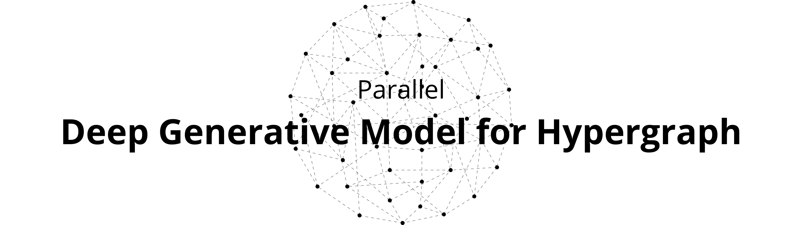

# Parallel Deep Hypergraph Generation

Implementation of the tools described in the thesis work in computer science "Modelli Generativi per Ipergrafi mediante l'Utilizzo di Tecniche di Deep Learning".

## Content

- [How to Use](#how-to-use)
    - [Generative Workflow](#generation-workflow)
    - [Training Pipe](#training-pipe)
    - [Hypergraph Analysis Tool](#hypergraph-analysis-tool)
- [Model Architecture](#model-architecture)

## How to Use

### Generation Workflow

The hypergraph generation process can be performed by running the following command from the console. The parameters accepted by the command are:

- **dataset**: the dataset to use, every file in the *data* folder is an available option for this command.
- **processes**: amount of processes to use.
- **n**: the quantity of hyperedges to generate.

```bash
python3 generate.py --dataset "email-Eu" -n 25027 --processes 32
```

The generated hypergraph can be found in the *generated* folder.

### Training Pipe

```bash
python3 train.py --dataset "email-Eu" -epochs 250 --device "cuda"
```

### Hypergraph Analysis Tool

the project includes an analysis tool for the generated hypergraphs. In particular it is useful for producing results relating to the following structural patterns of hypergraph decompositions: *Giant Connected Component*, *Clustering Coefficient*, *Effective Diameter*, *Number of Closed Triangles*, *Singular Value Distribution*, *Degree Distribution*.

```bash
python3 analyze.py --dataset "email-Eu" -k 1    # Node-level analysis
python3 analyze.py --dataset "email-Eu" -k 2    # Edge-level
python3 analyze.py --dataset "email-Eu" -k 3    # Triangle-level
python3 analyze.py --dataset "email-Eu" -k 4    # 4clique-level
```

## Model Architecture


